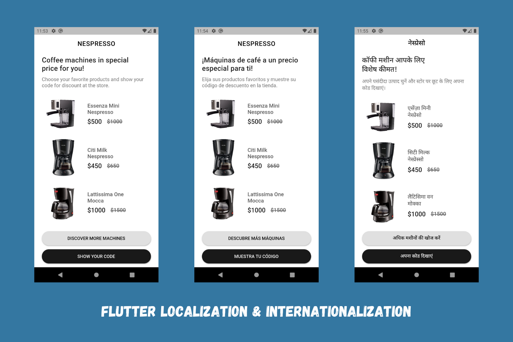

# Flutter Localizations Example

Easily localize your Flutter app - Internationalize with JSON that contains translated strings for different locales.

- This project works with three different locales - English, Spanish and Hindi.

## Preview

## Getting Started

For help getting started with Flutter, view our
[online documentation](https://flutter.dev/docs), which offers tutorials,
samples, guidance on mobile development, and a full API reference.

### If you like this repository, kindly give it a star ⭐
